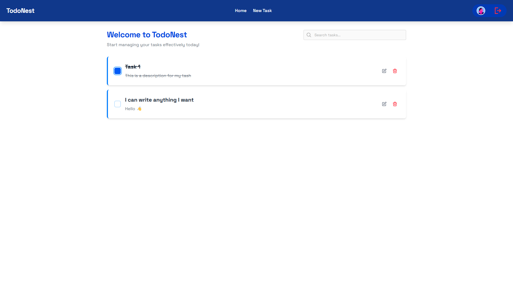

# 🚧 Work In Progress 🚧

# TodoNest - Full Stack Task Management Application

TodoNest is a comprehensive task management application built with Angular and NestJS. It provides a secure, intuitive platform for users to manage their daily tasks with authentication to keep data private.



## Features

- **Robust Authentication System**
  - User registration with email validation
  - Secure login functionality
  - JWT-based authentication
  - Protected routes

- **Comprehensive Task Management**
  - Create, read, update, and delete todos
  - Mark tasks as completed
  - Task descriptions and categorization
  - Search and filter capabilities

- **Responsive UI**
  - Works across desktop and mobile devices
  - Clean, intuitive interface
  - Modern design with TailwindCSS

## Tech Stack

### Frontend (Angular)
- Angular 19
- TailwindCSS
- Custom component library
- Reactive forms
- HTTP interceptors for auth

### Backend (NestJS)
- NestJS framework
- Prisma ORM
- PostgreSQL database
- JWT authentication
- RESTful API design

## Project Structure

The application is organized into two main directories:

```
todo-nest-angular-with-auth/
├── frontend/       # Angular application
├── backend/        # NestJS API
└── README.md       # Main documentation
```

## API Endpoints

### Authentication
- `POST /auth/register` - Register a new user
- `POST /auth/login` - Login with credentials
- `POST /auth/logout` - Logout current user

### Users
- `GET /users/me` - Get current user profile
- `PATCH /users/:id` - Update user data

### Todos
- `GET /todos` - Get all user todos
- `GET /todos/:id` - Get specific todo
- `POST /todos` - Create new todo
- `PATCH /todos/:id` - Update todo
- `DELETE /todos/:id` - Delete todo

## Getting Started

### Prerequisites
- Node.js (v14 or later)
- npm or yarn
- PostgreSQL database

### Installation

1. Clone the repository:
   ```bash
   git clone https://github.com/yourusername/todo-nest-angular-with-auth.git
   cd todo-nest-angular-with-auth
   ```

2. Set up the backend:
   ```bash
   cd backend
   npm install

   # Create a .env file with your database connection and JWT secret
   # Run prisma migrations
   npx prisma migrate dev

   npm run start:dev
   ```

3. Set up the frontend:
   ```bash
   cd ../frontend
   npm install
   ng serve
   ```

4. Open your browser and navigate to `http://localhost:4200`

## Core Components

### UI Components
- Button component with multiple variants
- Input component with validation states
- Navbar component for navigation
- Card components for todos

### Data Models

**User**
```typescript
{
  id: string;
  username: string;
  firstName: string;
  lastName: string;
  email: string;
  passwordHash: string;
  createdAt: Date;
  updatedAt: Date;
}
```

**Todo**
```typescript
{
  id: string;
  userId: string;
  title: string;
  description?: string | null;
  isCompleted: boolean;
  createdAt: Date;
  updatedAt: Date;
}
```

## Security

- Passwords are hashed using bcrypt
- JWT tokens for secure authentication
- Guards for route protection
- HTTP-only cookies for enhanced security

## Development

### Frontend Development
```bash
cd frontend
ng serve
```

### Backend Development
```bash
cd backend
npm run start:dev
```

### API Documentation
After starting the backend server, visit `/api-docs` to see the interactive Swagger API documentation.

## Deployment

1. Build the frontend:
   ```bash
   cd frontend
   ng build --configuration production
   ```

2. Build the backend:
   ```bash
   cd backend
   npm run build
   ```

3. Deploy the built applications to your hosting provider.

## Contributing

Contributions are welcome! Please feel free to submit a Pull Request.

## License

This project is licensed under the MIT License.
